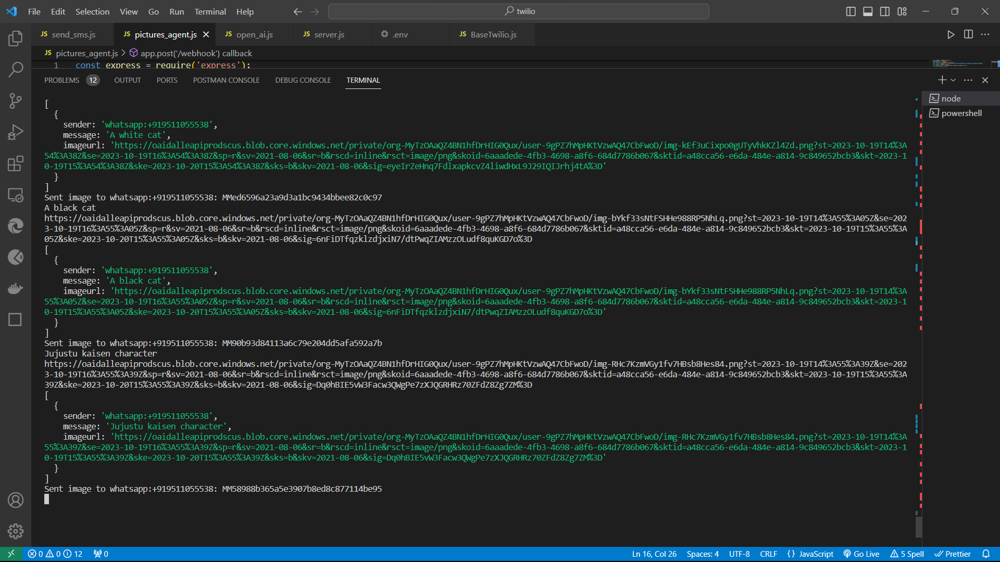

# WhatsApp Image Generator with DALL·E and Twilio Using Nodejs

This project demonstrates how to build a WhatsApp image generator using OpenAI's DALL·E and Twilio. The application listens for incoming WhatsApp messages, processes them, generates images with DALL·E, and sends them as replies. In this `README.md`, you will find setup instructions and troubleshooting tips to ensure a smooth development process.

## Prerequisites

To get started with this project, you will need the following:

- A Twilio account with a WhatsApp-enabled phone number.
- An OpenAI account with API access.
- Node.js installed on your system.
- Basic knowledge of JavaScript and web development.

## Setup

1. **Install Required Packages**: Initialize a Node.js project and install the necessary packages using npm.

   ```bash
   npm init
   npm install express twilio openai body-parser dotenv
   ```

2. **Configure Environment Variables**: Create a `.env` file and store your environment variables.

   ```
   TWILIO_ACCOUNT_SID=your_twilio_account_sid
   TWILIO_AUTH_TOKEN=your_twilio_auth_token
   OPEN_AI_KEY=your_openai_api_key
   ```

   Replace the placeholders with your actual credentials.

3. **Create a Webhook**: Set up an Express.js app to create a webhook that handles incoming WhatsApp messages, generates images with DALL·E, and sends them as replies. An example code snippet is provided in the blog post.

## Setup for getting Whatsapp No. from Twilio 

Open `Twilio Console` , So, on Dashboard from The `Develop` section, click on `Messaging` is shown Or Otherwise search `Messaging services`,then dropdown the `try it out` , then select `Send a whatsapp message` , Then Add the Whatspp no. by scanning the qr code using sandbox..


Hence you will successfuly get a Twilio Whatsapp Number By Following those steps.

Certainly! Here's an explanation of the basics of the code that can be added to the `README.md`:

---
## Key Components

### 1. Webhook Configuration

The heart of the project is the webhook that listens for incoming WhatsApp messages. It is created using the Express.js framework. The code for setting up the webhook is found in `app.js`:

```javascript
// Initialize the required libraries and services
const express = require('express');
const bodyParser = require('body-parser');
const client = require('twilio')(process.env.TWILIO_ACCOUNT_SID, process.env.TWILIO_AUTH_TOKEN);
const openai = require('openai');
const openaiClient = new openai.OpenAIApi({ key: process.env.OPEN_AI_KEY });

// ...
```

### 2. Handling Incoming Messages

The application captures incoming WhatsApp messages, processes them, and generates images based on the received text prompts. The core logic is located in the `/webhook` route:

```javascript
app.post('/webhook', async (req, res) => {
  const incomingMessage = req.body.Body;
  const senderWhatsAppNumber = req.body.From;

  // Implement DALL·E image generation logic here
  const imageGenerationResult = await generateImageWithDALLE(incomingMessage);

  // Send the generated image as a reply
  const message = await client.messages.create({
    from: `whatsapp:+14155238886`,
    body: 'Here is the image you requested:',
    mediaUrl: [imageGenerationResult],
    to: senderWhatsAppNumber,
  });

  // Log the chat history
  console.log('Chat History:', chatHistory);

  res.sendStatus(200);
});
```

### 3. Image Generation with DALL·E

The `generateImageWithDALLE` function is responsible for interacting with the OpenAI API, specifically DALL·E, to create images based on text prompts:

```javascript
async function generateImageWithDALLE(text) {
  // Implement image generation logic here
  const response = await openaiClient.davinci.create({
    prompt: text,
    n: 1,
    size: '1024x1024',
  });
  const image_url = response.data[0].url;
  return image_url;
}
```

## Testing

First run the command in the terminal
```
node app.js
```
then run the command in another terminal for the ngrok 
```
ngrok http 3000

```
now copy the ngrok url


again open the `Twilio console` and open The dashboard where you get your `Twilio Whatsapp No.`
 

and paste the ngrok url in sandbox configuration as shown in above screenshot.

So, Now you image_generation agent is deployed successfully using a local machine


and the Terminal on server end will be like this




## Troubleshooting Tips

During development, you may encounter common issues. Here are some troubleshooting tips to help you overcome them:

1. **API Key and Environment Variables**: Ensure that your environment variables (`TWILIO_ACCOUNT_SID`, `TWILIO_AUTH_TOKEN`, and `OPEN_AI_KEY`) are correctly set in your `.env` file.

2. **OpenAI API Configuration**: Verify that the OpenAI package (`openai`) is correctly installed.

3. **Webhook Testing**: Test your webhook locally by sending sample WhatsApp messages to ensure the endpoint functions as expected.

4. **API Rate Limits**: Be aware of API rate limits for both Twilio and OpenAI. Monitor your API usage and consider upgrading your subscription if necessary.

5. **Error Handling**: Implement error handling in your code to catch and log any potential errors.

## Conclusion

By following the steps outlined in this README, you can build a WhatsApp image generator using DALL·E and Twilio. You will have a fully functional system for receiving messages, generating images based on text prompts, and sending those images as replies. Additionally, you will be prepared to troubleshoot common issues that may arise during development.

Happy coding and enjoy exploring the creative possibilities of DALL·E in your WhatsApp application!

---